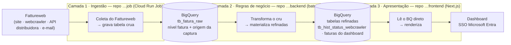

# ADR 0001 — Arquitetura em 3 camadas do Monitor de Aquisição de Fatura (Fattureweb)

- Status: aceito
- Data: 2026-07-30
- Autor: Arquimedes
- Escopo: canônico do projeto (repo-âncora `matrix.fattureweb.webcrawler.job`)

## Contexto

O produto dá visibilidade à **aquisição de fatura** dos clientes **Matrix Fácil B**
(Energia Fácil B). Ele evoluiu de um monitor de *status por instalação* para um
modelo **nível de fatura**: cada fatura de Matrix Fácil B, registrando **como ela foi
obtida** — site da distribuidora, *webcrawler*, API da distribuidora ou recebida por
**encaminhamento de e-mail**. (O schema detalhado nível-fatura será mapeado e virará
um ADR/spec próprio.)

O projeto nasceu orgânico: um único **Cloud Run Job** que coletava do Fattureweb e
gravava uma tabela-snapshot no BigQuery, mais uma **UI Next.js** lendo o BQ direto.
Com o novo modelo, surge a necessidade de uma etapa de **regras de negócio** entre a
ingestão crua e a apresentação (classificar a origem da captura, materializar
histórico diário, montar a tabela que o dashboard consome).

Já existem **3 repositórios** para o projeto; a decisão é como organizá-los e como os
dados fluem entre eles.

## Decisão

Vamos organizar o projeto como **um só produto em 3 camadas**, um repositório por
camada, no padrão **raw → refined → apresentação**, com o **BigQuery como contrato**
entre as camadas (o schema das tabelas é a interface; não há chamada direta entre
serviços):

| Repositório | Camada | Papel |
|---|---|---|
| `matrix.fattureweb.webcrawler.job` | **Ingestão (raw)** | Cloud Run Job: coleta do Fattureweb e grava a tabela **crua nível de fatura** no BQ, com a origem da captura. |
| `matrix.fattureweb.webcrawler.backend` | **Regras de negócio (refined)** | Job batch de transformação: lê o cru e materializa as **tabelas refinadas** que alimentam o dashboard (histórico diário `tb_hist_status_webcrawler`, tabela de faturas do dashboard, etc.). |
| `matrix.fattureweb.webcrawler.frontend` | **Apresentação** | App Next.js: **lê as tabelas refinadas direto do BigQuery** (route handlers server-side), sem API HTTP intermediária. |

**Documentação (canônico + ponteiro):** o **PRD** e os **ADRs canônicos** do projeto
vivem no repo-âncora (`…job`), em `docs/prd/` e `docs/adr/`. Os repos `…backend` e
`…frontend` carregam um `docs/README.md` curto que **aponta para o canônico** e
descreve o **papel daquela camada**. Uma fonte da verdade, foco por etapa.

### Diagrama

O BigQuery é o **contrato** entre as camadas: cada seta que cruza uma camada é uma
tabela, não uma chamada direta entre serviços.

## Consequências

**Positivas:**
- Separação clara de responsabilidades (ingestão · regras de negócio · UI); cada
  camada é deployável e testável isoladamente.
- O **schema das tabelas BQ vira contrato explícito** entre camadas — acoplamento
  fraco, evolução independente enquanto o contrato se mantém.
- O frontend continua simples (lê BQ direto), sem uma API a mais para operar.
- Extensível: novas tabelas refinadas (ex.: novos recortes do dashboard) entram na
  camada de regras **sem tocar** na ingestão.

**Negativas / custos:**
- **3 repos para coordenar**: uma mudança que atravessa camadas toca mais de um repo.
- O schema das tabelas é um **contrato cross-repo** — exige disciplina (uma mudança
  incompatível no cru quebra o refined e o front).
- Doc canônico num único repo: os outros dependem de um ponteiro (risco de o ponteiro
  desatualizar).

**Neutras:**
- **Dois jobs batch** a agendar (ingestão e transformação) — a cadência define a
  frescura do dashboard.
- O **schema nível-fatura** e o enum de **origem da captura** (site / crawler / API /
  e-mail) ficam para um ADR/spec posterior, quando mapeados.
- Este ADR **incorpora ao conjunto canônico** as decisões antes registradas por repo:
  o *layout do job como Cloud Run Job* (segue válido, agora na camada `…job`) e o
  *frontend standalone lendo BQ direto* (segue válido, camada `…frontend`).

## Alternativas consideradas

- **Monorepo (as 3 camadas num repo só)** — rejeitada: runtimes distintos (jobs
  Python vs app Next.js), deploys independentes, e o usuário quer separação física
  por camada.
- **`backend` como API HTTP que o front consome** — rejeitada: para um conjunto
  refinado pequeno, o front lendo o BQ direto é mais simples e não adiciona um serviço
  para operar; e casa com a definição "o backend **cria tabelas** que alimentam o
  dashboard". Vira a escolha certa se surgir um 2º consumidor das mesmas regras.
- **Manter 2 camadas (job + front, sem camada de negócio)** — rejeitada: as regras
  (classificação da origem da captura, histórico diário) precisam de um lugar que não
  seja a ingestão crua nem a UI; espremê-las no job ou no front fere a coesão.
